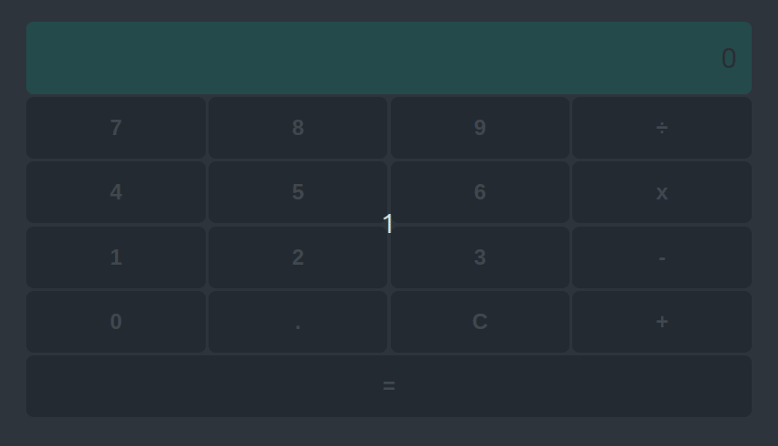

# Calculadora React

## :books: Projeto

Este projeto é uma calculadora, feito com React, como requisito do desafio da DIO - Digital Innovation One

## :computer: Tecnologias

- ReactJS
- Styled components

## :clap: Créditos
- Video Aulas: [DIO](https://www.dio.me/)